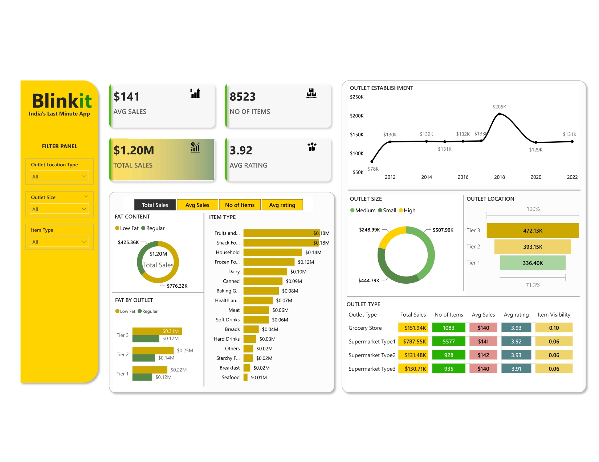

# Blinkit Data Analytics | Dashboard creation using Power BI

## Introduction
In this project, I leveraged Power BI to analyze and visualize Blinkit's operational and sales data using an Excel dataset. I performed data loading, cleaning, and transformation to ensure data accuracy and built an interactive dashboard to uncover key business insights, such as sales trends, customer behavior, and delivery performance.

## Dashboard

## Technology Used
- Power BI Tool

## Dataset Used
Data include fields capturing Item Fat Content, Item Identifier, Item Type, Outlet Establishment Year, Outlet Identifier, Outlet Location Type, Outlet Size, Outlet Type, Item Visibility, Item Weight, Sales, Rating.

Here is the dataset: https://github.com/Tameema-banu/Blinkit-Data-Analysis-Dashboard/blob/main/BlinkIT%20Grocery%20Data.xlsx
  
